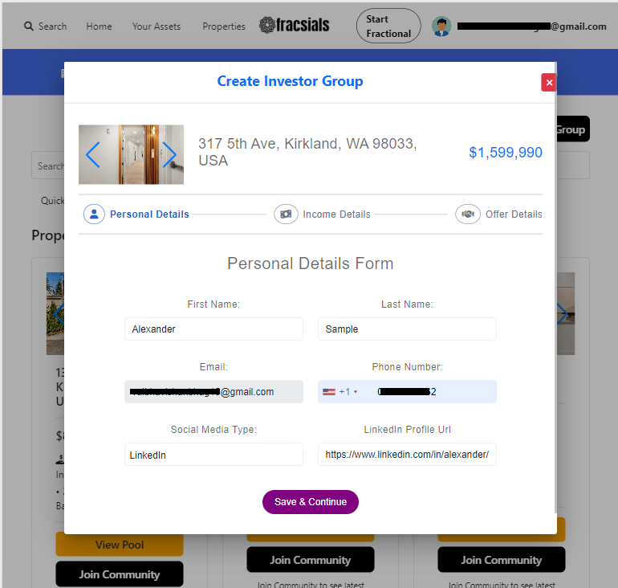

# User guide to Dashboard

## Register and Login

### 1.Registration:

- **User Details**: Users can register for the investor user dashboard by providing their email address, and password.

- **Verification Process**: The registration process includes email verification to ensure the security of user accounts.

- **Access Granted**: Upon successful registration, users gain access to investor-user dashboard where they can login and begin exploring investment opportunities.

### 2.Login:

- **User Authentication**: Registered users can log in to the investor user dashboard using their email address and password.

- **Security Measures**: The login process verifies user credentials against the registered account information to grant access.

- **Dashboard Access**: Once logged in, users can explore dashboard and thus investment opportunities.

## KYC Process

KYC (Know Your Customer) is an essential process in financial services and investment platforms like the Fracsials Investor Dashboard. It involves verifying the identity of users to ensure compliance with regulations and prevent fraud. Here's an overview of the KYC process:

### 1. Submission of KYC Details

- Users must choose the type of KYC document they want to submit. Currently, we are only allowing the submission of a U.S. driving license.
- Users are required to submit personal information such as their first name, last name, date of birth as per government-issued identification documents which should be submitted along.
- The KYC form typically includes fields for users to input this information accurately.

### 2. Document Verification

- Once the user submits their personal information, the platform's AI system performs the first level of verification by comparing the provided documents with the submitted details.
- If the AI verification is successful, the documents are then forwarded to a platform agent for the second level of verification.
- The agent verifies the authenticity of the provided documents and ensures that the user's identity matches the information provided.

#### Important Note:

- **Mandatory KYC Completion/Approval**: Users will not be able to invest in any properties or participate in investment pools without KYC Completion/Approval. Completing KYC is a mandatory step to ensure the security and compliance of the platform.

### 3. KYC Approval and Access Granted

- Once the KYC process is complete and the user's identity is verified, the user is granted access to the investor dashboard.
- Users can now explore investment opportunities and participate in the platform's offerings.

By implementing a robust KYC process, the Fracsials Investor Dashboard ensures the integrity of its user base while fostering a secure and trustworthy investment environment.

## Create ,Join ,Invest 

The Fracsials Investor Dashboard provides users with flexible options to invest in real estate properties. Users can create their own investment pools, join existing groups, and make investments. Here’s an overview of these processes:

### Option 1. Create & Join a Pool 

- **Initiate Pool Creation**: Users can create an investment pool by selecting the "Create Pool" option on the dashboard. This allows them to start a new investment group for a specific property.

- **Provide Pool Details**: Users must enter details such as the property address, city, and zipcode. They can also specify the amount required if not mentioned to fully fund the property.

- **Join the pool**: Before joining pool, users must enter their personal details, income details and offer details.Offer details asks for type of investment where **Active** and **Passive** are two types.

1. **Passive Investment**: If users are interested but not ready to invest immediately, they can mark their interest by filling out the investment form without depositing funds. This status is known as passive investment.

2. **Active Investment**: The investment process becomes active once the funds are deposited. The platform’s agents update the user’s investment status upon successful transaction completion.Then they can click on **Edit Investment** to make investment active and to edit other investment details.

### Option 2. Join Existing pools

- **Explore Available Pools**: Users can browse and explore existing investment pools available on the dashboard. Each pool provides details about the property, investment terms, and current progress.
- **Select a Pool**: After finding a suitable pool, users can select it to view more detailed information and decide if they want to join.
- **Fill Investment Form**: To join a pool, users need to fill out an investment form with details such as the amount they wish to invest, the type of investment, and their personal information.

**Note** : 
1. User must first deposit investment amount in his fracsials account to make **active** investments.
2. User can only create and join 2 pools.
3. Check **Assets** to know your account balance.

- **Submit Pool & Invest Request**: Once the details are filled out, the pool & Invest request is sent to agent. The platform's agents review the submission to ensure compliance and feasibility.

- **Tracking Investments**: Users can track the status of their investments, view their portfolio, and monitor the progress of their pools through the user dashboard.

By offering a streamlined process for creating pools, joining groups, and making investments, including options for active and passive investments, the Fracsials Investor Dashboard enables users to engage in real estate investment easily and effectively.